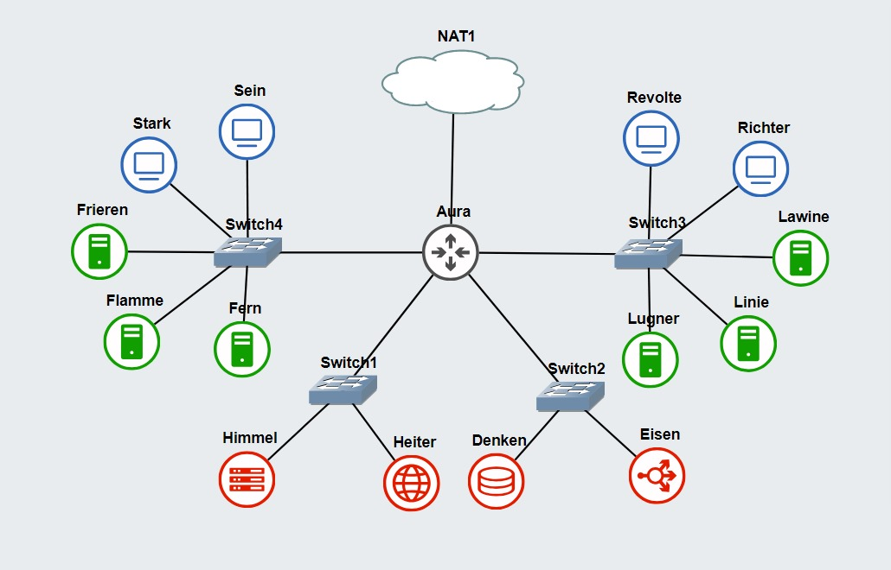

# Jarkom-Modul-3-D24-2023
Laporan Praktikum Kelas Jaringan Komputer 2024
Kelompok D24.

## Author
<ul>
  <li>Daffa Saskara - 5025211249</li>
  <li>Arundaya Pratama Nurhasan - 5025221205</li>
</ul>

# Laporan Revisi
## No. 1

Setelah membuat topologi seperti pada gambar diatas, selanjutnya kita perlu menyeting konfigurasi pada setiap node sebagai berikut.

- **Aura (DHCP Relay)**
```
auto eth0
iface eth0 inet dhcp
iptables -t nat -A POSTROUTING -o eth0 -j MASQUERADE -s 192.203.0.0/16

auto eth1
iface eth1 inet static
	address 192.203.1.0
	netmask 255.255.255.0

auto eth2
iface eth2 inet static
	address 192.203.2.0
	netmask 255.255.255.0

auto eth3
iface eth3 inet static
	address 192.173.3.0
	netmask 255.255.255.0

auto eth4
iface eth4 inet static
	address 192.173.4.0
	netmask 255.255.255.0

```
- **Himmel (DHCP Server)**
```
auto eth0
iface eth0 inet static
	address 192.203.1.1
	netmask 255.255.255.0
	gateway 192.173.1.0

```
- **Heiter (DNS Server)**
```
auto eth0
iface eth0 inet static
	address 192.173.1.2
	netmask 255.255.255.0
	gateway 192.173.1.0
  up echo nameserver 192.168.122.1 > /etc/resolv.conf
```
- **Denken (Database Server)**
```
auto eth0
iface eth0 inet static
	address 192.173.2.1
	netmask 255.255.255.0
	gateway 192.173.2.0
  up echo nameserver 192.168.122.1 > /etc/resolv.conf
```
- **Eisen (Load Balancer)**
```
auto eth0
iface eth0 inet static
	address 192.173.2.2
	netmask 255.255.255.0
	gateway 192.173.2.0
```
- **Frieren (Laravel Worker)**
```
auto eth0
iface eth0 inet static
	address 192.173.4.3
	netmask 255.255.255.0
	gateway 192.173.4.0
  up echo nameserver 192.168.122.1 > /etc/resolv.conf
```
- **Flamme (Laravel Worker)**
```
auto eth0
iface eth0 inet static
	address 192.173.4.2
	netmask 255.255.255.0
	gateway 192.173.4.0
  up echo nameserver 192.168.122.1 > /etc/resolv.conf
```
- **Fern (Laravel Worker)**
```
auto eth0
iface eth0 inet static
	address 192.173.4.1
	netmask 255.255.255.0
	gateway 192.173.4.0
  up echo nameserver 192.168.122.1 > /etc/resolv.conf
```
- **Lawine (PHP Worker)**
```
auto eth0
iface eth0 inet static
	address 192.173.3.3
	netmask 255.255.255.0
	gateway 192.173.3.0
  up echo nameserver 192.168.122.1 > /etc/resolv.conf
```
- **Linie (PHP Worker)**
```
auto eth0
iface eth0 inet static
	address 192.173.3.2
	netmask 255.255.255.0
	gateway 192.173.3.0
  up echo nameserver 192.168.122.1 > /etc/resolv.conf
```
- **Lugner (PHP Worker)**
```
auto eth0
iface eth0 inet static
	address 192.173.3.1
	netmask 255.255.255.0
	gateway 192.173.3.0
  up echo nameserver 192.168.122.1 > /etc/resolv.conf
```
- **Richter (Client)**
```
auto eth0
iface eth0 inet static
	address 192.173.3.4
	netmask 255.255.255.0
	gateway 192.173.3.0
  up echo nameserver 192.168.122.1 > /etc/resolv.conf
```
- **Revolte (Client)**
```
auto eth0
iface eth0 inet static
	address 192.173.3.5
	netmask 255.255.255.0
	gateway 192.173.3.0
  up echo nameserver 192.168.122.1 > /etc/resolv.conf
```
- **Stark (Client)**
```
auto eth0
iface eth0 inet static
	address 192.173.4.4
	netmask 255.255.255.0
	gateway 192.173.4.0
  up echo nameserver 192.168.122.1 > /etc/resolv.conf
```
- **Sein (Client)**
```
auto eth0
iface eth0 inet static
	address 192.173.4.5
	netmask 255.255.255.0
	gateway 192.173.4.0
  up echo nameserver 192.168.122.1 > /etc/resolv.conf
```
