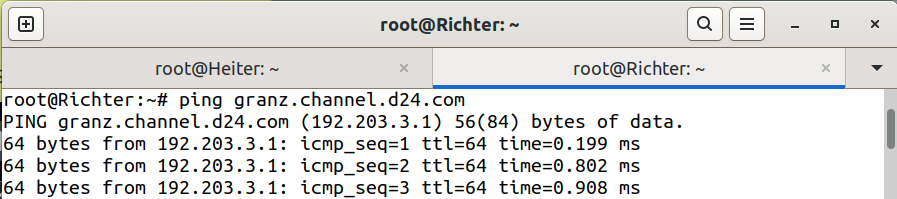

# Jarkom-Modul-3-D24-2023
Laporan Praktikum Kelas Jaringan Komputer 2024
Kelompok D24.

## Author
<ul>
  <li>Daffa Saskara - 5025211249</li>
  <li>Arundaya Pratama Nurhasan - 5025221205</li>
</ul>

# Laporan Revisi
## No. 1
Perjalanan selanjutnya akan menggunakan peta berikut:

Setelah membuat topologi seperti pada gambar diatas, selanjutnya kita perlu menyeting konfigurasi untuk setup awal pada setiap node sebagai berikut.

- Aura (DHCP Relay)
```
auto eth0
iface eth0 inet dhcp

auto eth1
iface eth1 inet static
	address 192.203.1.0
	netmask 255.255.255.0

auto eth2
iface eth2 inet static
	address 192.203.2.0
	netmask 255.255.255.0

auto eth3
iface eth3 inet static
	address 192.203.3.0
	netmask 255.255.255.0

auto eth4
iface eth4 inet static
	address 192.203.4.0
	netmask 255.255.255.0

```
- Himmel (DHCP Server)
```
auto eth0
iface eth0 inet static
	address 192.203.1.1
	netmask 255.255.255.0
	gateway 192.173.1.0

```
- Heiter (DNS Server)
```
auto eth0
iface eth0 inet static
	address 192.203.1.2
	netmask 255.255.255.0
	gateway 192.203.1.0
	up echo nameserver 192.168.122.1 > /etc/resolv.conf
```
- Denken (Database Server)
```
auto eth0
iface eth0 inet static
	address 192.203.2.1
	netmask 255.255.255.0
	gateway 192.203.2.0
	up echo nameserver 192.203.1.2 > /etc/resolv.conf
```
- Eisen (Load Balancer)
```
auto eth0
iface eth0 inet static
	address 192.203.2.2
	netmask 255.255.255.0
	gateway 192.203.2.0
	up echo nameserver 192.203.1.2 > /etc/resolv.conf
```
- Frieren (Laravel Worker)
```
auto eth0
iface eth0 inet static
	address 192.203.4.3
	netmask 255.255.255.0
	gateway 192.203.4.0
	up echo nameserver 192.203.1.2 > /etc/resolv.conf
```
- Flamme (Laravel Worker)
```
auto eth0
iface eth0 inet static
	address 192.203.4.2
	netmask 255.255.255.0
	gateway 192.203.4.0
	up echo nameserver 192.203.1.2 > /etc/resolv.conf
```
- Fern (Laravel Worker)
```
auto eth0
iface eth0 inet static
	address 192.203.4.1
	netmask 255.255.255.0
	gateway 192.203.4.0
	up echo nameserver 192.203.1.2 > /etc/resolv.conf
```
- Lawine (PHP Worker)
```
auto eth0
iface eth0 inet static
	address 192.203.3.3
	netmask 255.255.255.0
	gateway 192.203.3.0
	up echo nameserver 192.203.1.2 > /etc/resolv.conf
```
- Linie (PHP Worker)
```
auto eth0
iface eth0 inet static
	address 192.203.3.2
	netmask 255.255.255.0
	gateway 192.203.3.0
	up echo nameserver 192.203.1.2 > /etc/resolv.conf
```
- Lugner (PHP Worker)
```
auto eth0
iface eth0 inet static
	address 192.203.3.1
	netmask 255.255.255.0
	gateway 192.203.3.0
	up echo nameserver 192.203.1.2 > /etc/resolv.conf
```
- Richter (Client)
```
auto eth0
iface eth0 inet static
	address 192.203.3.4
	netmask 255.255.255.0
	gateway 192.203.3.0
	up echo nameserver 192.203.1.2 > /etc/resolv.conf
```
- Revolte (Client)
```
auto eth0
iface eth0 inet static
	address 192.203.3.5
	netmask 255.255.255.0
	gateway 192.203.3.0
	up echo nameserver 192.203.1.2 > /etc/resolv.conf
```
- Stark (Client)
```
auto eth0
iface eth0 inet static
	address 192.203.4.4
	netmask 255.255.255.0
	gateway 192.293.4.0
	up echo nameserver 192.203.1.2 > /etc/resolv.conf
```
- Sein (Client)
```
auto eth0
iface eth0 inet static
	address 192.203.4.5
	netmask 255.255.255.0
	gateway 192.203.4.0
	up echo nameserver 192.203.1.2 > /etc/resolv.conf
```
Kemudian kita mengubah file `.bashrc` dengan memasukkan perintah `nano .bashrc` pada node `DNS Relay` dan menambahkan baris berikut.
  ```sh
  iptables -t nat -A POSTROUTING -o eth0 -j MASQUERADE -s 192.203.0.0/16

  apt-get update
  apt install isc-dhcp-relay -y
  ```
selanjutnya melakukan setup untuk node `DNS Server` sebagai berikut
  ```sh
  apt-get update
  apt-get install bind9 -y

  echo 'zone "riegel.canyon.d24.com" {
    type master;
    file "/etc/bind/sites/riegel.canyon.d24.com";
  };

  zone "granz.channel.d24.com" {
    type master;
    file "/etc/bind/sites/granz.channel.d24.com";
  };

  zone "1.203.192.in-addr.arpa" {
    type master;
    file "/etc/bind/sites/1.203.192.in-addr.arpa";
  };' > /etc/bind/named.conf.local

  mkdir -p /etc/bind/sites
  cp /etc/bind/db.local /etc/bind/sites/riegel.canyon.d24.com
  cp /etc/bind/db.local /etc/bind/sites/granz.channel.d24.com
  cp /etc/bind/db.local /etc/bind/sites/1.203.192.in-addr.arpa

  echo ';
  ; BIND data file for local loopback interface
  ;
  $TTL    604800
  @       IN      SOA     riegel.canyon.d24.com. root.riegel.canyon.d24.com. (
                          2023111601      ; Serial
                           604800         ; Refresh
                            86400         ; Retry
                          2419200         ; Expire
                           604800 )       ; Negative Cache TTL
  ;
  @       IN      NS      riegel.canyon.d24.com.
  @       IN      A       192.203.4.1     ; IP Fern
  www     IN      CNAME   riegel.canyon.d24.com.' > /etc/bind/sites/riegel.canyon.d24.com

  echo '
  ; BIND data file for local loopback interface
  ;
  $TTL    604800
  @       IN      SOA     granz.channel.d24.com. root.granz.channel.d24.com. (
                          2023111601      ; Serial
                           604800         ; Refresh
                            86400         ; Retry
                          2419200         ; Expire
                           604800 )       ; Negative Cache TTL
  ;
  @       IN      NS      granz.channel.d24.com.
  @       IN      A       192.203.3.1     ; IP Lugner
  www     IN      CNAME   granz.channel.d24.com.' > /etc/bind/sites/granz.channel.d24.com

  echo 'options {
        directory "/var/cache/bind";

        forwarders {
                192.168.122.1;
        };

        // dnssec-validation auto;
        allow-query{any;};
        auth-nxdomain no;
        listen-on-v6 { any; };
  }; ' >/etc/bind/named.conf.options

  service bind9 start
  ```
kita bisa melihat hasilnya dengan melakukan perintah `ping riegel.canyon.d24.com` dan `ping granz.channel.d24.com` pada salah satu node `client`, kali ini kita meenggunakan node `Richter`. Pastikan node Lugner dan Fern telah berjalan.




## No. 2
>Semua CLIENT harus menggunakan konfigurasi dari DHCP Server.

Untuk melakukan hal tersebut pertama-tama kita perlu menyeting `DNS Server` terlebih dahulu dengan menuliskan perintah
  ```sh
  apt-get update
  apt install isc-dhcp-server -y
  ```
Kemudian merubah konfigurasi untuk node-node `client` sebagai berikut
  ```sh
  auto eth0
  iface eth0 inet dhcp
  ```
>Client yang melalui Switch3 mendapatkan range IP dari [prefix IP].3.16 - [prefix IP].3.32 dan [prefix IP].3.64 - [prefix IP].3.80

Selanjutnya pada node `DNS Server` kita perlu menambahkan perintah dibawah ini pada file `.bashrc`
  ```sh
  echo 'subnet 192.203.1.0 netmask 255.255.255.0 {
  }

  subnet 192.203.2.0 netmask 255.255.255.0 {
  }

  subnet 192.203.3.0 netmask 255.255.255.0 {
      range 192.203.3.16 192.203.3.32;
      range 192.203.3.64 192.203.3.80;
      option routers 192.203.3.0;
  }' > /etc/dhcp/dhcpd.conf
  ```

## No. 3
>Client yang melalui Switch4 mendapatkan range IP dari [prefix IP].4.12 - [prefix IP].4.20 dan [prefix IP].4.160 - [prefix IP].4.168
Pada node `DNS Server` kita perlu menambahkan perintah dibawah ini pada file `.bashrc`
  ```sh 
  subnet 192.203.4.0 netmask 255.255.255.0 {
      range 192.203.4.12 192.203.4.20;
      range 192.203.4.160 192.203.4.168;
      option routers 192.203.4.0;
  } ' > /etc/dhcp/dhcpd.conf
  ```

## No. 4
>Client mendapatkan DNS dari Heiter dan dapat terhubung dengan internet melalui DNS tersebut

sekarang kita akan menambahkan beberapa konfigurasi pada `DNS Server` dengan merubah file `.bashrc` sebagai berikut
  ```sh
  echo 'subnet 192.203.1.0 netmask 255.255.255.0 {
  }

  subnet 192.203.2.0 netmask 255.255.255.0 {
  }

  subnet 192.203.3.0 netmask 255.255.255.0 {
      range 192.203.3.16 192.203.3.32;
      range 192.203.3.64 192.203.3.80;
      option routers 192.203.3.0;
      option broadcast-address 192.203.3.255;
      option domain-name-servers 192.203.1.2; 
  }

  subnet 192.203.4.0 netmask 255.255.255.0 {
      range 192.203.4.12 192.203.4.20;
      range 192.203.4.160 192.203.4.168;
      option routers 192.203.4.0;
      option broadcast-address 192.203.4.255;
      option domain-name-servers 192.203.1.2;
  } ' > /etc/dhcp/dhcpd.conf

  service isc-dhcp-server start
  ```
Kemudia pada node `DHCP Relay` kita perlu manambahkan perintah berikut
  ```sh
  echo '# Defaults for isc-dhcp-relay initscript
  # sourced by /etc/init.d/isc-dhcp-relay
  # installed at /etc/default/isc-dhcp-relay by the maintainer scripts

  #
  # This is a POSIX shell fragment
  #

  # What servers should the DHCP relay forward requests to?
  SERVERS="192.203.1.1"

  # On what interfaces should the DHCP relay (dhrelay) serve DHCP requests?
  INTERFACES="eth1 eth2 eth3 eth4"

  # Additional options that are passed to the DHCP relay daemon?
  OPTIONS=""' > /etc/default/isc-dhcp-relay

  service isc-dhcp-relay start
  ```

Lalu pada file ``/etc/sysctl.conf`` lakukan uncommented pada ``net.ipv4.ip_forward=1``

Terakhir jangan lupa untuk restart seluruh client agar dapat melakukan leasing IP dari DHCP Server
  
## No. 5
>Lama waktu DHCP server meminjamkan alamat IP kepada Client yang melalui Switch3 selama 3 menit sedangkan pada client yang melalui Switch4 selama 12 menit. Dengan waktu maksimal dialokasikan untuk peminjaman alamat IP selama 96 menit

Untuk mengatur leasing time pada switch3 dan switch4 sesuai dengan aturan soal, kita perlu menambahkan beberapa konfigurasi pada `DHCP Server` di file `.bashrc` menjadi seperti berikut.

  ```sh
  echo 'subnet 192.203.1.0 netmask 255.255.255.0 {
  }

  subnet 192.203.2.0 netmask 255.255.255.0 {
  }

  subnet 192.203.3.0 netmask 255.255.255.0 {
      range 192.203.3.16 192.203.3.32;
      range 192.203.3.64 192.203.3.80;
      option routers 192.203.3.0;
      option broadcast-address 192.203.3.255;
      option domain-name-servers 192.203.1.2;
      default-lease-time 180;
      max-lease-time 5760;
  }

  subnet 192.203.4.0 netmask 255.255.255.0 {
      range 192.203.4.12 192.203.4.20;
      range 192.203.4.160 192.203.4.168;
      option routers 192.203.4.0;
      option broadcast-address 192.203.4.255;
      option domain-name-servers 192.203.1.2;
      default-lease-time 720;
      max-lease-time 5760;
  }

  service isc-dhcp-server restart
  ```


